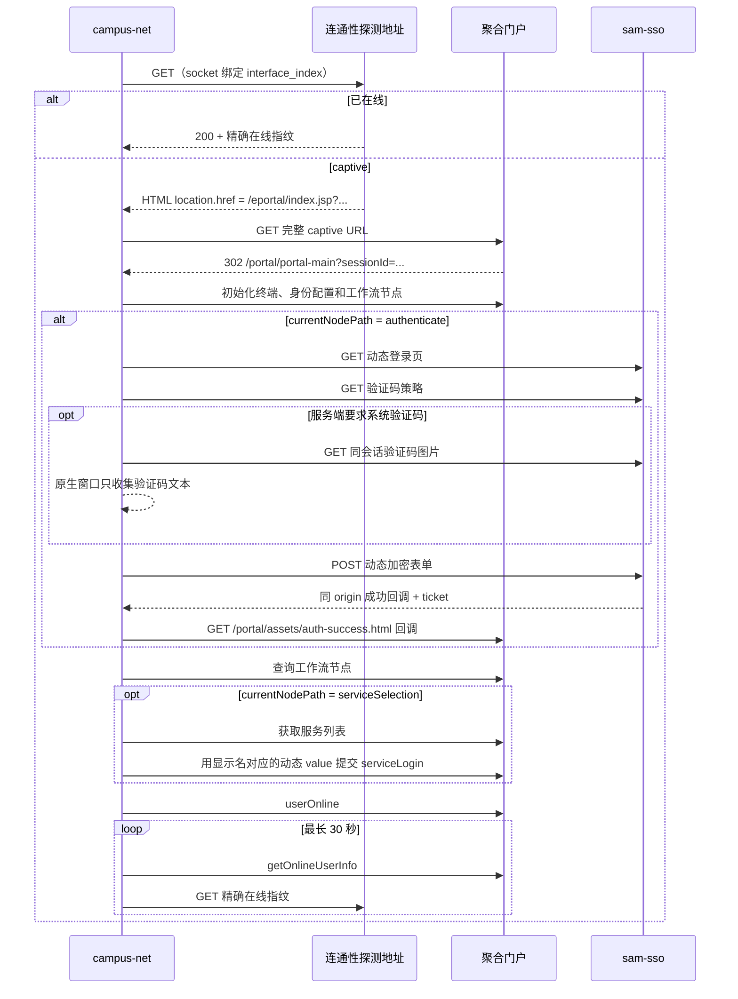

# 新版 captive SSO 适配记录

本文记录 `campus-net` 从旧版 ePortal 适配到新版聚合 captive SSO 的分析过程、协议结论、实现结构和验证方法。它面向后续维护者，不替代项目根目录的使用说明。

适用基线：2026-07-17。实现入口见 [`main.py`](../main.py)，新版协议代码位于 [`campus_net/`](../campus_net/)。

## 1. 适配目标与边界

本次适配的目标是：

- 保留旧版 `/eportal/InterFace.do?method=login` 登录能力；
- 支持从 captive 劫持页进入的新版聚合认证流程；
- 不打开或控制浏览器，只用 HTTP 请求复现门户前端的必要协议；
- 同时存在校园网、手机热点、有线网或代理软件时，让新版 socket 显式请求使用指定校园网接口，而不是依赖默认路由；
- 自动完成账号密码提交、运营商选择和在线确认；
- 服务端要求系统图形验证码时，只让用户输入验证码，其余步骤继续自动完成；
- 不以登录页提示或 Windows 网络图标作为唯一成功依据。

这里的“纯 HTTP”指不依赖浏览器自动化。程序仍需要遵守服务端验证码和风控协议，不包含 OCR、验证码猜测或绕过逻辑。

## 2. 旧版与新版的根本差异

旧版 ePortal 的核心是一次表单提交：从门户首页提取 `queryString`，再向 `/eportal/InterFace.do?method=login` 提交账号、旧版加密密码、运营商和若干 Cookie。

新版不是单一登录接口，而是由四层状态共同组成：

1. captive 劫持入口提供当前连接的接入参数；
2. 聚合门户创建 `sessionId` 并维护 `portal_auth` 工作流；
3. `sam-sso` 完成身份认证并返回 ticket；
4. 聚合门户根据动态服务值完成运营商认证，最后把终端置为在线。

因此，直接打开固定的 `/sam-sso/login` 即使能看到登录页，也不能等价替代 captive 入口。它缺少当前接入会话产生的 `flowSessionId`、终端信息和聚合门户上下文；仅完成 SSO 也没有执行后续运营商选择与 `userOnline` 流程。

分析期间还排除了两个看似可用、实际不能作为稳定起点的浏览器地址：`/portal/entry/pc/authenticate;flowParams=undefined;from=` 带有字面量 `undefined`，没有可复用的完整流程上下文；带 `service=...` 的 `/sam-sso/login` 则只是身份认证子流程。真正稳定的起点只能来自当前连接被劫持后的 captive 响应。

## 3. 分析过程

本次分析没有访问服务端源码。协议结论来自当前网络下的实际 HTTP 响应、门户下发的 HTML/前端行为、错误返回和脱敏测试夹具；未观测到的服务端行为不作为实现假设。

### 3.1 先保留旧实现和本地配置

适配开始前没有覆盖旧协议，而是先把原实现视为 `legacy-eportal` 基线。迁移实际 `config.json` 前先复制到仓库外并校验 SHA-256，确保配置重构失败时仍可恢复。仓库中只保留脱敏示例，账号、密码、Cookie、ticket 和 `sessionId` 都不进入版本控制。

### 3.2 解决多网络并存问题

分析时外网连接和校园网连接需要同时存在。如果依赖 Windows 默认路由，HTTP 请求可能经过手机热点、以太网、系统代理或 TUN，而不是正在等待认证的校园网接口，抓到的结果也就失去意义。

新版实现不按 WLAN 名称判断网络，而是要求一个 Windows IPv4 `interface_index`。每个 aiohttp socket 在连接前设置：

```text
IPPROTO_IP / IP_UNICAST_IF / network-byte-order(interface_index)
```

这样 Wi-Fi、有线网卡或其他 IPv4 接口都使用同一套逻辑。它减少普通默认路由造成的选择歧义；程序不会修改系统路由、sing-box 或 v2rayN 配置。`IP_UNICAST_IF` 只能要求 socket 选定接口，不能证明最终物理出口。内核级 TUN/WFP 仍可能透明截获流量，甚至返回可被分类为 `ONLINE` 或 `CAPTIVE` 的合法响应；需要证明物理出口时仍应使用抓包或系统路由诊断。

运行时不会把任何接口名称或类型固定为校园网。校园网可以位于 WLAN、以太网或其他 IPv4 接口，配置应指向实际承载校园网的接口索引。配置接口未连接、没有可用路由或无法完成探测时，流程保持 `UNKNOWN`，且不会创建无绑定连接器或自动回退到其他网络接口。交互式 CLI 会在第一次探测会话关闭后列出 Windows IPv4 接口；只有用户显式选择后，才以 `dataclasses.replace()` 创建仅用于当前进程的运行时配置并建立新的绑定会话，磁盘配置和凭据不被改写。用户取消、接口枚举失败或终端非交互时以退出码 `2` 停止。提示中不暴露 `aiohttp`、主机、SSL 或本地化 socket 异常细节。识别门户后的 HTTP 超时或连接错误同样由 CLI 与 GUI 共用的异常分类器转换为通用接口提示，不直接显示底层传输异常。接口已通过独立在线指纹时只说明该接口已经联网；如果校园网位于另一接口，用户仍需改选对应的 IPv4 接口。

连接器同时固定 `AF_INET` 并启用 `force_close=True`：当前流程只创建 IPv4 socket，也不复用持久连接。

实现见 [`campus_net/captive.py`](../campus_net/captive.py) 中的 `WindowsInterfaceSocketFactory` 和 `create_bound_connector()`。

### 3.3 从 captive 响应取得真实入口

新版不能把 `/sam-sso/login` 或某次捕获的长 URL 固定到配置中。程序先通过绑定接口请求 Windows 连通性探测地址：

```text
http://www.msftconnecttest.com/connecttest.txt
```

响应按以下顺序分类：

- HTML 脚本中存在合法的 `location.href` 赋值：`CAPTIVE`；
- 状态码和响应体精确等于在线指纹：`ONLINE`；
- 其他响应或歧义响应：`UNKNOWN`。

识别出的 captive URL 必须同时满足：

- 与配置的门户根地址同 origin；
- 路径严格等于 `/eportal/index.jsp`；
- `wlanuserip`、`wlanacname`、`nasip`、`mac` 各出现一次且非空；
- 不含用户信息、路径参数或片段；
- 页面中只能出现一个不同的合法入口。

程序保留门户给出的完整 URL，不重排或重新编码查询串。非法 captive 入口不会因为同一响应碰巧匹配在线指纹而被忽略。

### 3.4 还原聚合门户工作流

请求真实 `/eportal/index.jsp?...` 后，程序要求门户返回 `302`，并校验跳转到同 origin 的 `/portal/portal-main`。跳转 URL 中必须有：

- `sessionId`
- `customPageId`
- `nasIp`
- `userIp`
- `userMac`

随后按门户前端顺序初始化：

1. `GET /portal/portal-main`；
2. `GET /eportal/adaptor/queryTerminalInfo`；
3. `POST /eportal/network/getIdentityConfig`；
4. `POST /eportal/workFlow/getCurrentNode`，查询 `flowKey=portal_auth`。

当前节点决定下一步：

- `authenticate`：进入 SSO；
- `serviceSelection`：账号身份已完成，直接选择运营商；
- `finish`：认证工作流已经完成；
- 其他节点：按未知协议停止，不猜测下一步。

### 3.5 还原 SSO 动态表单

SSO 页面不是静态表单。程序使用聚合门户上下文构造 `/sam-sso/login` 查询参数，再从页面提取：

- `login-croypto`：Base64 编码的 128 位本次登录密钥；
- `login-page-flowkey`：动态 `execution`；
- `recaptchaVendor`：验证码提供方；
- `riskSystemSwitch`：风控类型；
- `login-error-code` 和 `login-error-msg`：登录结果信息。

如果页面启用第三方 reCAPTCHA、Geetest 一类验证，或 `USTC` 指纹风控，纯 HTTP 客户端会明确停止。当前实现只支持无验证码和门户自身的 `system` 图形验证码。

账号密码表单中的关键字段如下：

| 字段 | 处理方式 |
| --- | --- |
| `username` | 原值提交 |
| `password` | AES-128-ECB、PKCS#7 padding，再 Base64 |
| `execution` | 使用当前页面动态值 |
| `croypto` | 回传当前页面动态密钥字符串 |
| `captcha_payload` | 将紧凑 JSON `{}` 用同一密钥加密 |
| `captcha_code` | 系统图形验证码明文；要求验证码时保持前端的重复字段形态 |
| `_eventId` | 固定为 `submit` |
| `type` | 固定为 `UsernamePassword` |

表单使用有序的键值对列表而不是字典，原因是验证码分支存在两个同名 `captcha_code` 字段，普通字典会错误地合并它们。

登录只在以下响应形态下被判定为成功：

- 状态码为 `302` 或 `303`；
- 跳转仍在同一 origin；
- 路径严格为 `/portal/assets/auth-success.html`；
- 查询串中恰好有一个非空 `ticket`。

程序随后访问该聚合门户回调，让 SSO 结果回到门户会话；回调 GET 必须返回 HTTP 200，否则认证结果按不确定处理。其他重定向、跨 origin 回调或结构不明的 200 页面都不会被误判为成功。

### 3.6 验证码策略与会话关系

系统验证码由服务端会话决定，图片、Cookie、动态密钥、`execution` 和登录 POST 必须位于同一个 `aiohttp.ClientSession`。对 IP 地址门户启用 `CookieJar(unsafe=True)`，否则 aiohttp 默认会拒绝保存 IP host 下发的会话 Cookie。这里的 `unsafe` 只放宽 IP host Cookie 规则，不代表关闭 TLS 校验。

验证码策略查询复现了前端的受保护请求头：

1. 生成 32 字符随机 `Csrf-Key`；
2. 对它进行 Base64 编码；
3. 在编码串中点插入一份完整编码串；
4. 对组合结果计算 MD5，得到 `Csrf-Value`。

首次提交先查询 `DEFAULT_CAPTCHA_SWITCH`；默认策略未要求验证码时，再查询当前用户名。服务端要求验证码后，程序从同一 SSO origin 获取图片。CLI 路径显示原生 Tkinter 窗口，窗口不可用时才退回临时图片文件和终端输入，临时文件在输入结束后删除；GUI 路径通过线程安全事件把图片交给 Tk 主线程，在同一个应用根窗口下显示验证码对话框。两种路径都只回传用户输入的文本，不把图片交给浏览器、OCR 或第三方服务。

只有服务端明确返回验证码错误码 `1320007` 时，客户端才刷新页面、策略和图片后继续输入。账号密码错误、未知错误、超时或无法解析的响应都不会触发自动重放。`captcha_attempts=0` 是内部默认值，表示客户端不额外设置次数上限，不代表绕过服务端校验。

#### 3.6.1 验证码协议的逆向思路

这里的“逆向”是还原浏览器与服务端之间的公开 HTTP 合约，不是反编译服务端。分析时依次回答五个问题：

1. **谁决定是否出题**：比较默认策略和按用户名查询的 JSON，确认决定来自服务端的 `captchaInvisible`，不是页面本地开关；
2. **题目如何取得**：跟踪 `captchaUrl`、受保护请求头、Cookie 和时间戳，确认图片必须从当前 SSO 会话读取；
3. **答案放在哪里**：检查浏览器等价表单的有序字段，确认答案以明文 `captcha_code` 提交，并且验证码分支保留两个同名字段；
4. **哪些字段参与加密**：用页面提供的已知密钥核对请求构造，确认只有 `password` 和内容为 `{}` 的 `captcha_payload` 使用 AES，用户名和验证码答案不使用该算法；
5. **服务端如何反馈**：比较已有成功、验证码错误和普通登录错误响应，确认只有 `1320007` 是可刷新图片后继续的验证码错误。

分析结果可以表示为：

```text
当前 HTTP 会话
  ├─ Cookie + execution + crypto_key
  ├─ captcha policy -> required + captchaUrl
  ├─ captcha image -> 当前客户端仅按图像字节处理
  └─ login POST -> captcha_code + 加密密码 + 加密的空 payload
                         │
                         └─ 最终校验由服务端完成，内部存储或派生方式未知
```

在当前观察到的 HTTP 与前端合约中，客户端能看到“题目图片”和“答案输入位置”，但没有观察到独立答案字段、可替代校验令牌或本地校验函数。实现不知道服务端是存储答案还是无状态派生答案。已分析的客户端流程只把动态 AES 密钥用于密码和 payload 的传输，没有发现用它推导图片文字的步骤；当前 `captcha_payload` 解密后是 `{}`，`1320007` 则是提交后的错误结果。

#### 3.6.2 常见“破解”假设的证据评估

| 假设 | 现有证据与结论 |
| --- | --- |
| 从 `crypto_key` 推出验证码 | 在已分析的前端流程中，密钥只用于 AES 表单字段，验证码以明文独立提交；没有观察到客户端推导步骤 |
| 解密 `captcha_payload` 得到答案 | 当前客户端构造的 payload 明文固定为 `{}`，其中没有字符答案 |
| 把 `captchaInvisible` 改成 `false` | 该值只是服务端策略响应；修改本地判断不会改变登录 POST 的服务端校验 |
| 省略 `captcha_code` 或伪造成功回调 | 服务端仍维护工作流与 ticket；客户端还会严格核对同 origin 回调、节点和在线状态 |
| 复用旧图片、旧答案或旧 ticket | 当前流程把图片、Cookie、`execution`、动态密钥和 ticket 作为具体会话状态使用，持久化复用不构成已知的稳定协议 |
| 不断提交任意答案 | 没有可推导关系，只会产生自动化试错和潜在账号风险；本项目不实现这种行为 |
| OCR 或第三方代答 | 这会把“人工读取服务端挑战”改成自动求解或转交挑战，超出本项目的协议自动化边界，也可能泄露会话相关图片 |

因此，当前观察到的客户端合约中，未发现除视觉挑战外的机器可读答案来源或可替代校验令牌。项目可以继续自动化验证码前后的全部流程，但不会实现验证码破解、OCR、暴力枚举、第三方代答或伪造校验结果。若学校以后提供正式的无障碍验证、设备授权或可信 API，应优先按其公开协议接入。

### 3.7 动态选择运营商

配置只保存运营商显示名，例如“中国电信”，不保存某次会话中的内部值。进入 `serviceSelection` 后，程序：

1. `POST /eportal/network/serviceSelection` 获取本次会话的服务数组；
2. 要求显示名精确匹配且只匹配一项；
3. 取该项动态 `value`；
4. `POST /eportal/network/serviceLogin`；
5. 要求业务结果中的 `authResult` 严格等于 `success`。

这避免把内部服务标识误当成长期稳定配置，也避免同名多项时随意选择。

### 3.8 双重确认真正在线

门户工作流到达 `finish` 后，程序调用 `/eportal/network/userOnline`，但不会只相信这次 POST 的成功文案。最终在最长 30 秒内循环确认两件事：

1. `/eportal/adaptor/getOnlineUserInfo` 返回在线用户且结果为 `success`；
2. 绑定校园网接口重新访问连通性探测地址，状态码为 200 且响应体精确为 `Microsoft Connect Test`。

两者必须在同一次验证窗口内同时成立，才输出“校园网登录完成”。这解决了“门户显示成功，但电脑实际仍不能访问互联网”的假阳性。

## 4. 完整请求序列



## 5. 会话一致性与非幂等请求保护

新版流程从第一次 captive 探测到最终在线确认共用一个绑定接口的 `ClientSession`。这保证：

- Cookie 不跨接口或跨会话丢失；
- 验证码图片与验证码 POST 属于同一服务端会话；
- captive URL、`sessionId`、动态密钥、`execution` 和 ticket 不被持久化复用；
- 所有请求都保持相同接口选择。

对可能产生状态变化的请求采用“不确定即不重放”原则：

- SSO 登录 POST 超时或响应无法解析时，先只读查询当前工作流节点；
- `serviceLogin` 结果不确定时，先检查节点是否已经到 `finish`；
- `userOnline` 结果不确定时，改用只读在线状态和独立探测确认；
- 只有明确的 `1320007` 才重新提交验证码登录表单。

这避免网络抖动时重复认证、重复运营商登录或错误消耗服务端状态。

## 6. 输入与响应校验

实现没有把门户返回值直接拼接到任意请求中，而是逐层收紧边界：

- captive 响应最多读取 64 KiB，入口 URL 最长 4096 字符；
- SSO 页面和登录响应最多读取 512 KiB，验证码图片最多 2 MiB；
- URL 必须是 HTTP/HTTPS，关键跳转和验证码图片必须同 origin；
- 关键查询参数必须唯一，重复参数会中止流程；
- 只接受预期路径，不跟随任意重定向；
- 门户 JSON 同时校验 HTTP 状态、业务 `code`、`data` 类型和关键字段；
- 正式 `version=1/2` 扁平配置拒绝未知字段，避免拼写错误被静默忽略；无版本历史格式保留原有宽松兼容边界；
- 密码保留原始空白字符，并从配置对象的 `repr` 中隐藏。

这些校验既用于发现门户升级造成的协议漂移，也用于避免 captive 页面中的异常内容把客户端引向错误地址。

## 7. 配置版本设计

公开配置只用 `version` 选择协议，而不是表达 JSON schema 的修订号：

| `version` | 协议 | 密码形态 | 用途 |
| --- | --- | --- | --- |
| `1` | `legacy-eportal` | 旧门户加密值 `encrypted_password` | 原 `/eportal/InterFace.do?method=login` |
| `2` | `captive-sso-http` | 明文 `password`，提交前按动态密钥加密 | 新版聚合 captive SSO |

新版只暴露六个稳定字段：

```json
{
  "version": 2,
  "interface_index": 24,
  "portal_url": "http://10.71.29.181",
  "username": "你的校园网账号",
  "password": "你的校园网密码",
  "carrier": "中国电信"
}
```

User-Agent、探测指纹、入口路径、验证码策略常量、确认间隔和超时由实现维护。它们属于当前协议适配，不要求每个用户跟着门户升级手改配置。

兼容策略如下：

- 新配置必须显式填写 `version=1` 或 `version=2`；
- 无 `version`、带 `adapter: "captive-sso-http"` 的早期嵌套配置继续读取；
- 无 `version` 的历史 Cookie ePortal 配置继续读取；
- 已移除的 `schema_version` 和顶层 `mode` 会给出迁移错误，不做含糊推断；
- 新旧密码字段不能混用。

解析和兼容实现见 [`campus_net/config.py`](../campus_net/config.py)。

## 8. 模块职责

| 文件 | 职责 |
| --- | --- |
| [`main.py`](../main.py) | CLI 配置查找、参数解析、交互式接口选择和顶层退出码处理 |
| [`gui_main.py`](../gui_main.py) | GUI 参数解析和独立可执行文件入口 |
| [`campus_net/application.py`](../campus_net/application.py) | CLI 与 GUI 共用的协议分派和错误分类 |
| [`campus_net/config.py`](../campus_net/config.py) | `version` 分派、配置校验、历史配置兼容和内部默认值 |
| [`campus_net/config_paths.py`](../campus_net/config_paths.py) | 源码与打包态共用的配置候选路径和 `dist` 父项目目录回退 |
| [`campus_net/config_store.py`](../campus_net/config_store.py) | 正式配置编辑、并发修订检查、校验备份和原子保存 |
| [`campus_net/captive.py`](../campus_net/captive.py) | Windows 接口绑定、captive URL 提取、在线指纹分类 |
| [`campus_net/interfaces.py`](../campus_net/interfaces.py) | CLI 与 GUI 共用的 Windows IPv4 接口枚举、状态归一化和排序 |
| [`campus_net/aggregate.py`](../campus_net/aggregate.py) | 聚合门户工作流、验证码策略、运营商选择和在线确认 |
| [`campus_net/sso.py`](../campus_net/sso.py) | SSO 页面解析、AES 表单、验证码 URL 和登录结果判定 |
| [`campus_net/interactive.py`](../campus_net/interactive.py) | CLI 原生验证码窗口和无 GUI 时的临时文件回退 |
| [`campus_net/runner.py`](../campus_net/runner.py) | 串联新版流程、运行时接口重试和不确定 POST 的只读状态核对 |
| [`campus_net/legacy.py`](../campus_net/legacy.py) | 保留旧版 ePortal 登录流程 |
| [`campus_net/gui_core.py`](../campus_net/gui_core.py) | GUI 后台任务、事件队列、验证码桥接和表单校验 |
| [`campus_net/gui.py`](../campus_net/gui.py) | `ttkbootstrap` 主线程窗口、配置编辑和用户交互 |
| [`campus_net/window_state.py`](../campus_net/window_state.py) | 窗口位置、尺寸、最大化状态的无敏感信息持久化与多显示器校正 |

### 8.1 GUI 并发与配置保存边界

图形界面和 CLI 共用 `application.execute_config()`，不会维护第二套校园网协议实现。Tk/`ttkbootstrap` 控件只在主线程创建和更新；连接任务在单独线程中运行自己的 asyncio 事件循环，通过队列上报日志、结果和验证码图片。验证码答案由请求 ID 关联回当前异步任务，关闭验证码窗口会取消当前连接，而不会提交空答案。取消发生在请求提交附近时，界面会明确提示服务端可能已经处理该请求，不把本地取消等同于服务端回滚。

CLI 与 GUI 共用的 IPv4 接口枚举固定调用 `%SystemRoot%\System32\WindowsPowerShell\v1.0\powershell.exe`，避免当前目录中的同名程序参与 Windows 可执行文件搜索。PowerShell 枚举值在 JSON 中可能是 `0/1` 数字，也可能是状态字符串；解析层统一归一化，再显示为“已连接”“未连接”或“正在认证”。GUI 枚举进程超时、失败或后台线程无法启动时都会恢复刷新按钮，用户仍可直接填写接口索引。CLI 只有在标准输入和标准输出都连接真实终端时才提供选择；管道、重定向、计划任务或 EOF 不会阻塞等待输入。

窗口关闭时把普通窗口的 `x/y`、宽高和最大化状态原子写入 `%LOCALAPPDATA%\Cedarflake\CampusNet\window-state.json`。该独立 UI 状态不含配置或登录数据，读取失败会静默回退默认布局。恢复时按 Windows 各显示器工作区检查负坐标和可见范围；原显示器不存在时回到主屏居中，尺寸同时受最小窗口和当前工作区约束。

GUI 只编辑显式带 `version=1` 或 `version=2` 的正式配置。无版本历史配置仍由 CLI 兼容读取，但 GUI 拒绝静默改写。连接和探测使用当前表单的内存副本；只有显式保存才写磁盘。

覆盖配置时，`config_store` 执行以下顺序：

1. 校验当前文件仍与加载时的 SHA-256 修订一致，阻止覆盖外部修改；
2. 把旧文件写入 Windows“文档”目录下的 `CampusNet Backups`；
3. 校验备份文件与旧文件的大小和 SHA-256；
4. 在配置所在目录写入并同步临时文件；
5. 再次核对修订后用同目录原子替换，并校验最终内容。

替换前的任何备份、修订或完整性检查失败都会停止保存并保留旧文件。内容未变化时不覆盖文件，也不创建重复备份；新建配置没有旧内容可备份。若原子替换后的目录同步或最终回读校验失败，磁盘状态已经无法由异常本身判断，GUI 会禁用继续保存、标记结果不确定并要求重新加载；已有旧文件时，替换前生成的校验备份仍用于恢复。配置路径不是普通文件、JSON 存在重复键、文件超过大小限制或包含未知正式字段时同样拒绝写入。备份与配置都含账号和密码，必须保持在版本控制之外。

打包态继续兼容原有的当前目录查找顺序，并在 EXE 同目录后增加一个受限回退：只有 EXE 目录名为 `dist`，且父目录同时包含 `pyproject.toml` 与 `config.example.json` 项目标记时，才检查父目录的 `config.json`。这覆盖本项目的 PyInstaller 输出布局，又不会对任意安装目录盲目向上搜索。`--print-config-path` 只解析并输出最终路径，不打开配置文件也不发出网络请求；显式 GUI `--config` 路径缺失时不会静默改用其他账号配置。

PyInstaller 保留两个独立入口：`build.spec` 生成控制台版 `Auto-Connect-CampusNet.exe` 并嵌入紫色多尺寸 `cli-icon.ico`；`gui.spec` 生成窗口版 `Auto-Connect-CampusNet-GUI.exe`，嵌入蓝色多尺寸 `app-icon.ico`，并只把 `app-icon.png` 作为窗口/Header 品牌素材加入 `datas`。本地 `config.json`、备份和运行时状态均不会嵌入可执行文件。

## 9. 退出码和可观察结果

| 退出码 | 含义 |
| --- | --- |
| `0` | 已在线、探测成功，或登录后双重在线确认成功 |
| `1` | 配置缺失、JSON 错误或字段校验失败 |
| `2` | 配置的 IPv4 接口不可用、探测结果无法识别，或旧版模式不支持 `--probe-only` |
| `3` | 登录被拒绝、结果不确定、验证码 UI、门户协议、HTTP/网络或超时错误 |
| `4` | 门户状态和独立连通性探测未能同时确认在线 |

`--probe-only` 不提交账号、密码、验证码或运营商认证。接口处于 captive 状态时，它仍会沿真实入口完成只读门户初始化、终端信息查询和当前工作流节点查询，而不是只发一个探测 GET；这让它可以同时验证接口选择与入口协议是否仍兼容。

## 10. 测试与实际验证

单元测试按协议边界拆分：

- `test_captive.py`：真实脚本形态、入口参数、origin/path、歧义响应、在线指纹、Windows socket 绑定和探测异常脱敏；
- `test_runner.py`：配置接口不可达时的退出码、显式运行时改选、配置不变、只使用绑定连接器和禁止自动回退；
- `test_sso.py`：动态字段、AES/PKCS#7、验证码策略、风险类型、成功回调和错误码；
- `test_aggregate.py`：完整会话顺序、CSRF 头、验证码刷新、非幂等请求不重放、运营商和双重在线判定；
- `test_captive_config.py`：`version=2` 六字段配置和早期嵌套配置兼容；
- `test_config.py`：`version=1`、历史 Cookie 配置和旧版在线判断；
- `test_config_store.py`：正式配置解析、修订冲突、强制备份、完整性校验和原子保存；
- `test_config_paths.py`：源码和打包态候选顺序、`dist` 父目录、显式路径与符号链接边界；
- `test_gui_core.py`：无 Tk 的表单、后台任务、取消、验证码桥接和接口列表测试；
- `test_main.py`：CLI 终端判定、通用接口列表、输入校验、取消和非交互边界；
- `test_window_state.py`：窗口状态原子保存、损坏回退、负坐标多显示器和离屏校正；
- `test_application.py`：CLI/GUI 共用协议分派、错误分类和后续网络异常脱敏。

项目级验证命令：

```powershell
uv sync --group dev
& .\.venv\Scripts\python.exe -m unittest discover -s tests -p "test_*.py" -v
& .\.venv\Scripts\python.exe main.py --probe-only
& .\.venv\Scripts\python.exe -m PyInstaller --clean --noconfirm build.spec
& .\.venv\Scripts\python.exe -m PyInstaller --clean --noconfirm gui.spec
```

子项目通过 `[tool.uv.workspace]` 声明独立的项目发现边界，避免 `uv sync` 把仓库根仅包含 Ruff 配置的 `pyproject.toml` 误报为缺少 `[project]` 的项目文件。环境仍由 uv 创建和同步；测试、探测和打包直接调用该环境的 Python，避免后续命令重复执行项目发现。

GUI 产物另提供 `--smoke-test`：只创建、更新并销毁主窗口，不读取配置、不枚举网卡也不访问网络，可用于构建后的窗口资源冒烟检查。本次适配还分别用源码入口和重新构建的 CLI EXE 执行了绑定接口探测，并在实际登录测试中确认最终成功条件为“门户在线状态 + 独立 HTTP 在线指纹”。完整测试数量随 GUI 边界用例增长，以全量测试命令的实际输出为准。

## 11. 已知限制

- 新版接口绑定当前只实现 Windows IPv4；非 Windows 或 IPv6 会明确报错。
- 只支持当前观察到的聚合门户节点：`authenticate`、`serviceSelection`、`finish`。
- 只支持无验证码和门户自身的系统图形验证码。
- 图形验证码需要人工读取；它是服务端认证条件，不是待补的浏览器自动化步骤。
- 不支持 reCAPTCHA、Geetest 和 USTC 指纹风控。
- 不修改系统路由、DNS、随机 MAC、sing-box 或 v2rayN 配置。
- 门户路径、隐藏字段、加密方式、错误码或 CSRF 算法变化后，需要更新实现和对应测试。

## 12. 后续门户升级时的排查顺序

如果新版再次变化，按以下顺序定位，避免直接修改密码加密或反复重放登录：

1. 用 `--probe-only` 确认 socket 绑定后的协议响应；如需证明最终物理出口，再使用抓包或系统路由诊断；
2. 检查 captive 响应是否仍给出 `/eportal/index.jsp` 以及四个接入参数；
3. 检查 `portal-main` 跳转参数和 `currentNodePath` 是否变化；
4. 检查 SSO 页的动态字段、验证码提供方和风控开关；
5. 检查验证码策略的 JSON、CSRF 算法和图片路径；
6. 检查登录成功回调路径以及 ticket 形态；
7. 检查服务列表的 `key/value` 结构和工作流节点；
8. 最后检查 `userOnline`、`getOnlineUserInfo` 和独立在线指纹。

调试日志和测试夹具必须脱敏。不要记录真实密码、验证码、Cookie、ticket、`sessionId`、IP、MAC 或可复用的完整 captive URL。
